# **MANUAL DE INSTALACIÓN DE HERRAMIENTAS**

A continuación te mostraremos las herramientas fundamentales que te permitirán desarrollar, desplegar y mantener aplicacionesbasadas en Spring Boot a lo largo del curso. Éstas son herramientas clave que utilizarás a lo largo de este viaje de aprendizaje.

Antes de comenzar, asegúrate de conocer la arquitectura y la versión de tu sistema operativo. Puedes verificaresta información en la configuración del sistema.

## **WINDOWS**

### **JDK JAVA**

Comenzamos con el más importante que es el Kit de Desarrollo de Software (SDK por sus siglas en inglés) para java, el JDK es esencial para el desarrollo java. Asegúrate de seguir cada paso cuidadosamente.

##### **Paso 1: Descargar el JDK**

1. Accede al sitio web oficial de Oracle: https://www.oracle.com/mx/java/technologies/downloads/.

2. En la sección "JDK Development Kit 17.0.9 downloads", te da 3 opciones:
   
   ****

3. Vamos a seleccionar x64 MSI Installer.

4. Acepta los términos de la licencia y descarga el instalador.

##### **Paso 2: Instalar el JDK**

1. Ejecuta el instalador descargado.

2. Una vez termine la descarga del archivo .msi debes dar doble clic en dicho archivo y aparecerá el instalador de nuestra OpenJDK:
   
   ****

3. Durante la instalación, se te pedirá que elijas la ubicación del directorio de instalación. Anota esta ubicación ya que la necesitarás más adelante.

4. Completa el proceso de instalación.

##### **Paso 3: Configurar las Variables de Entorno en Windows**

1. Abre el Panel de Control y busca "Variables de entorno" en la barra de búsqueda.
   
   ****

2. Selecciona "Editar las variables de entorno del sistema".

3. Selecciona"Variables de entorno".
   
   ****

4. Haz clic en Nueva.
   
   ****

5. Ingresa "JAVA_HOME" como nombre de la variable y la ruta de instalación del JDK como valor. Por ejemplo, C:\Program Files\Java\jdk-17 (Es la ruta donde instalamosen el punto 3).
   
   ****

6. Da clicken Aceptar.

7. Buscala variable"Path" en la listade variables del sistema y haz clicen "Editar".
   
   ****

8. En la nueva ventanada click en Nuevo y agrega `%JAVA_HOME%\bin`.
   
   ****

9. Asegúrate de guardar todos los cambios.

##### **Paso 4: Verificar la Instalación**

1. Abre la líneade comandos (cmd) y escribe `java -version`. Deberías ver la versión del JDK instalada.

2. También puedes escribir` javac -version` para verificar la instalación del compilador.
   
   ****

¡Felicidades! Has instalado con éxito el JDK de Java en tu sistema.

### **SPRING TOOLS SUITE**

Spring Tool Suite (STS), una herramienta integral diseñada para facilitar el desarrollo de aplicaciones basadas en el framework Spring y puedes configurarlo en tu IDE favorito (Eclipse, Visual Studio Code, o Theia). De igual manera existe el paquete "Eclipse (Bundle)" que es una distribución especializada de Eclipse que incluye por default el Spring Tools Suite, lo que evita la necesidad de configurar Eclipse manualmente con los complementos y herramientas necesarios para trabajar con proyectos Spring.

Para el curso, procederemos con la instalaciónde Visual Studio Code, seguido por la incorporación del Spring Tool Suite (STS) como extensión en VS Code. 

#### Visual Studio Code + Spring Tool Suite(STS)

##### **Paso 1: Instalar Visual Studio Code**

1. Accede al sitio oficial de Visual Studio Code: https://code.visualstudio.com/.

2. Haz clicen el botón "Download"para descargar el instalador de Windows.
   
   ****

3. Ejecuta el instalador descargado, (es posible que se tenga que ejecutar como administrador) y sigue las instrucciones del asistente de instalación.
   
   ****
   
   ****
   
   ****
   
   ****
   
   ****

4. Abre Visual Studio Code después de la instalación. ¡Felicidades, has instalado VS Code con éxito!

##### **Paso 2: Instalar la Extensión de Spring Boot en Visual Studio Code**

1. En VS Code, ve a la pestaña de "Extensions" (icono de cuatro cuadrados en la barra lateral izquierda) o presiona                    `Ctrl + Shift + X`.

2. En la barra de búsqueda,escribe"Spring Boot Extension Pack".
   
   ****

3. Encuentra la extensión proporcionada por VMware y haz clic en "Install" para instalar el paquete de extensiones.
   
   ****

4. Después de la instalación, es posible que se te pida que reinicies VS Code. Asegúrate de guardar cualquier trabajo antes de hacerlo.

##### **Paso 3: Configurar la Extensión de Spring Boot**

1. Una vez reiniciado VS Code, en la barra de búsqueda vas a escribir `>Spring Initializr` y deberás poder visualizar esas opciones.
   
   ****

2. Con esto ya tenemos configurada la extensión para comenzar a editar proyectos Spring Boot en Visual Studio Code.

¡Felicidades! Has instalado exitosamente Spring Tool Suite y está listo cualquiera de losdos IDEs que hayas seleccionado para nuestro curso.

### **PostgreSQL**

PostgreSQL, un sistema de gestión de bases de datos relacional de código abierto. Sigue estos pasos para lograr una instalación exitosa.

##### **Paso 1: Descargar PostgreSQL**

1. Accede al sitio oficial de descargas de PostgreSQL: https://www.postgresql.org/download/.
   
   ****

2. Selecciona el sistema operativo Windows y da clic en `Download the installer`.
   
   ****

3. Selecciona la versiónde Windows `(x86-64 ó x86-32)`.

4. Guarda el instalador en tu equipo.

##### **Paso 2: Instalar PostgreSQL**

1. Ejecuta el instalador descargado.
   
   ****

2. Elige la ubicaciónde instalación y haz clic en `Siguiente`.
   
   ****

3. En la sección de los componentes que deseas instalar se encuentran las herramientas de línea de comandos y las bibliotecas de desarrollo, por lo seleccionaremos todas:
   
   1. PostgreSQL Server: Es el motor de la base de datos PostgreSQL. Incluye el servidor que gestiona las conexiones de los clientes, ejecuta las consultas SQL y administra el almacenamiento de los datos. Este componente es esencial y siempre se instala, ya que también incluye bibliotecas y herramientas adicionales necesarias para el desarrollo de aplicaciones que utilizan PostgreSQL.
   
   2. Command Line Tools: Herramientas de línea de comandosque facilitan la administración y el uso de PostgreSQL. Incluye utilidadescomo psql para interactuar directamente con la base de datos desde la línea de comandos. Útil para administradores y desarrolladores que prefieren trabajardesdela terminal.
   
   3. pgAdmin(o Herramienta de Administración Gráfica):Una interfaz gráfica de usuario para administrar y visualizar bases de datos PostgreSQL. Permite realizar tareas administrativas, ejecutar consultas y gestionar objetos de la base de datos de manera visual. Recomendado para aquellos que prefieren una interfaz gráfica para administrar bases de datos.
   
   4. Stack Builder: Una herramienta que permite agregar extensiones y complementos a PostgreSQL. Puedes usar Stack Builder para instalar herramientas adicionales, controladores de conexión y otros complementos que puedan ser necesarios. Las herramientas para el curso lasveremos más adelanteen el punto 10.
      
      ****

4. Elige la ubicación de instalación de la data y haz clic en `Siguiente`.
   
   ****

5. Establece una contraseña para el super usuario (postgres). Asegúrate de recordar esta contraseña,ya que la necesitarás más adelante. 
   
   ****

6. Configura el puerto de escucha. Deja el valor predeterminado (5433) a menos que haya conflictos con otros servicios.
   
   ****

7. Selecciona la configuración regional a ser usada, en nuestro caso Spanish, México.
   
   ****

8. A continuaciónse muestra un resumen de instalación.
   
   ****

9. Comienza la instalación.
   
   ****

10. Al completar la instalación, te muestra una leyenda para inicializar la configuración de Stack Builder, la mantienes seleccionada y das clic en `Terminar`.
    
    ****

11. Se abrirá la ventana de configuración de Stack Builder, seleccionamos la versión y el puerto que instalamos y damos clicen `Siguiente`.
    
    ****

12. En la siguiente pantalla seleccionaremos la opción `pgJDBC v42.6.0-1` que permite la conectividad Java a PostgreSQL mediante JDBC.
    
    ****

13. Seleccionamos la ruta de descarga y damos clicen `Next`.
    
    ****

14. Una vez terminada se inicializa el instalador del JDBC.

****

15. Seleccionamos la ruta de instalación damos clic en `Next `y comienzala instalación.
    
    ****

16. Finalizamos con éxito la instalación.

****

##### **Paso 3: Configurar las Variables de Entorno en Windows**

1. Abre el Panel de Control y busca `Variables de entorno` en la barra de búsqueda.
   
   ****

2. Selecciona `Editar las variables de entorno del sistema`.

3. Selecciona `Variables de entorno`.
   
   ****

4. Haz clic en Nueva.
   
   ****

5. Ingresa "POSTGRESQL" como nombre de la variable y la ruta de instalación del JDK como valor. Por ejemplo, `C:\Program Files\Java\jdk-17` (Es la ruta donde instalamosen el paso 2-punto 3).
   
   ****

6. Da clicken `Aceptar`.

7. Buscala variable `Path` en la lista de variables del entorno y haz clicen `Editar`.
   
   ****

8. En la nueva ventanada clicken Nuevo y agrega `%POSTGRESQL%\bin`.
   
   ****

9. Asegúrate de guardar todos los cambios.

##### **Paso 4: Verificar instalación**

1. Abre el símbolo del sistema y ejecuta el siguiente comando para conectarse a PostgreSQL: `psql -U postgres -p 5433` e ingresarás tu contraseña (Paso 2-punto 5).
   
   ****

2. Si puedes iniciar sesión sin errores, la instalación fue exitosa.

¡Enhorabuena! Has completado con éxito la instalación de PostgreSQL. Este logro marca un paso adicional hacia la configuración completa de nuestro entorno para comenzar el curso. ¡Estamos listos para avanzar!

### **Postman**

Postman es una plataforma colaborativa que proporciona un entorno completo para el desarrollo y pruebade APIs. Esta herramientanos permite crear, compartir, probar y documentar microservicios de manera eficiente.

##### **Paso 1: Descargar Postman**

1. Accede al sitio oficial de descargas de Postman: https://www.postman.com/downloads/.
   
   ****

2. Seleccionala versiónde Postman de Windows.

3. Haz clic en el botón de descarga y guarda el archivo de instalación en tu sistema.

##### **Paso 2: Instalar Postman**

1. Ejecuta el instalador descargado.
2. Sigue las instrucciones del asistente de instalación.
3. Finalizala instalación.

##### **Paso 3: Iniciar Postman**

1. Después de la instalación,busca el icono de Postman en tu sistema y ábrelo.
2. En la primera ejecución, Postman te pedirá que inicies sesión o crees una cuenta. Puedes optar por hacerlo o simplemente cerrar la ventana para acceder a Postman sin iniciarsesión.

¡Felicidades! Has instalado Postman con éxito. 

### **cURL**

cURL es una herramienta de línea de comandos que permite transferir datos utilizando diversos protocolos, como HTTP, HTTPS, FTP, entre otros.

##### **Paso 1: **Descargar cURL

1. Abre tu navegador web y visita el sitio oficial de cURL en https://curl.se/windows/. 

2. En la sección "Win64 - Generic", haz clic en el enlace para descargar la versión más reciente de cURL para Windows 64-bit.

   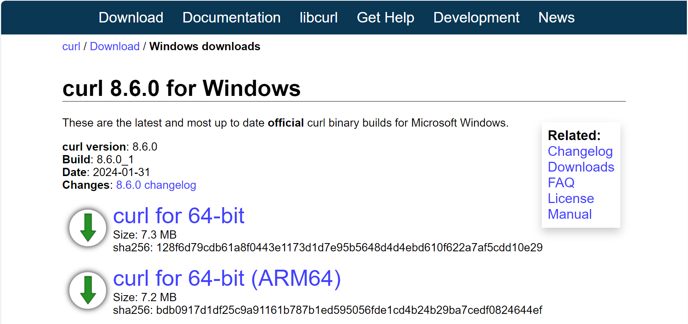

##### **Paso 2: **Instalar cURL

1. Una vez que se complete la descarga, haz doble clic en el archivo descargado para descomprimir.

   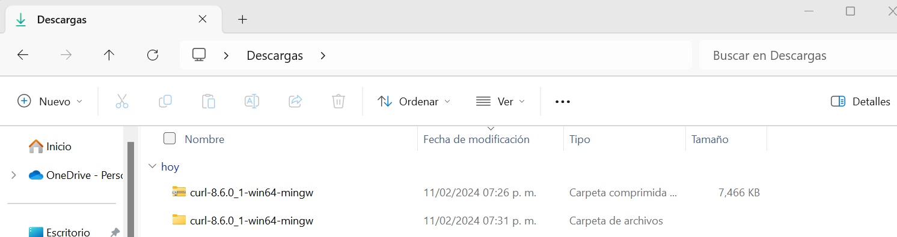

2. La carpeta descomprimida, puedes moverla a tu directorio de programas instalados, esto con el fin de mantener ordenado el directorio de programas.

**Paso 3: Configurar Variables de Entorno**

1. Abre el menú de inicio de Windows y busca "Editar variables de entorno del sistema".

   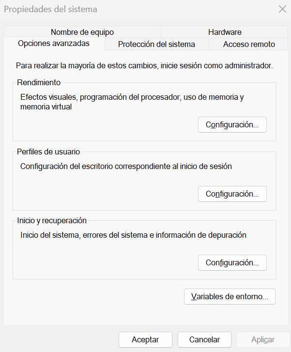

2. En la sección "Variables del sistema", selecciona la variable "Path" y haz clic en "Editar".

   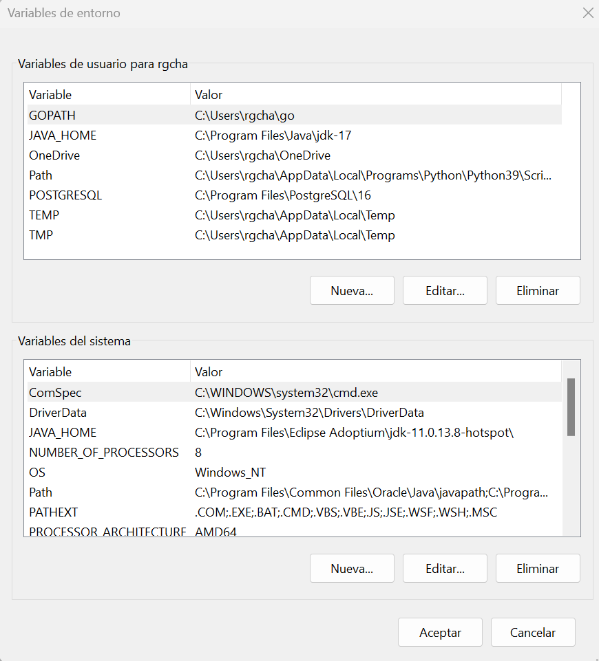

3. Haz clic en "Nuevo" y agrega la ruta de la carpeta donde se instaló cURL (por ejemplo, "C:\Program Files\cURL").

   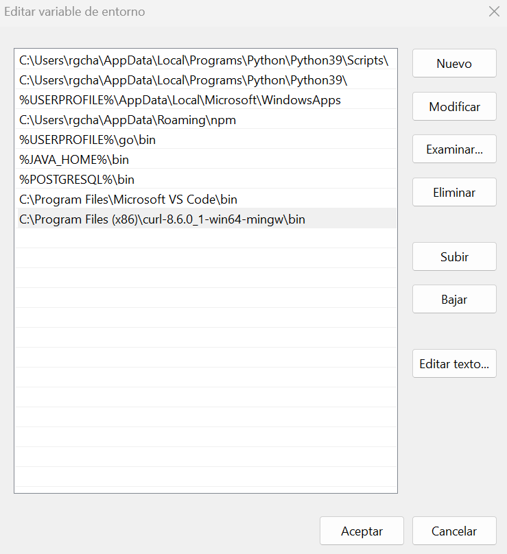

4. Haz clic en "Aceptar" para guardar los cambios y cerrar todas las ventanas.

**Paso 4: Verificar la Instalación**

1. Abre la línea de comandos de Windows.
2. Escribe el siguiente comando y presiona Enter: `curl --version`.
3. Si cURL se instaló correctamente, verás la información de la versión de cURL en la línea de comandos.

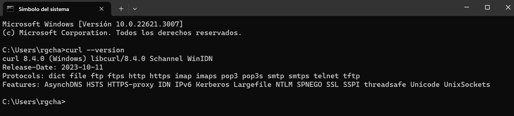

¡Felicidades! Has instalado cURL en tu sistema Windows. Ahora ya podemos utilizar esta potente herramienta para realizar transferencias de datos desde la línea de comandos a lo largo del curso.

### APACHE**MAVEN**

Apache Maven es una poderosa herramienta de gestión de proyectos y construcción de software utilizada principalmente para proyectos Java.

##### **Paso 1: **Descargar Apache Maven

1. Abre tu navegador web y visita el sitio oficial de Apache Maven en https://maven.apache.org/download.cgi.

   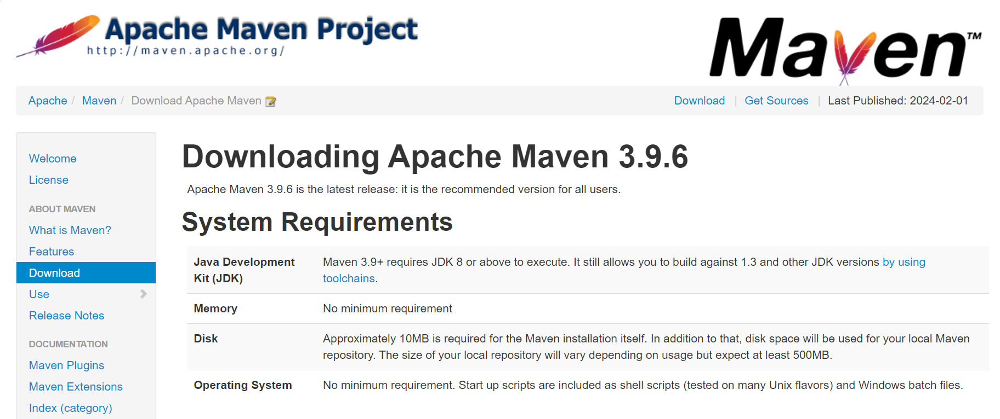

2. En la sección "Files", busca la última versión de Apache Maven Binary zip archive. Esto será un archivo comprimido con extensión ".zip".

3. Haz clic en el enlace de descarga para comenzar la descarga del archivo ZIP de Apache Maven.

**Paso 2: Descomprimir Apache Maven:**

1. Una vez completada la descarga, navega hasta la carpeta donde se descargó el archivo ZIP de Apache Maven (generalmente la carpeta "Descargas").

2. Haz clic derecho en el archivo ZIP de Apache Maven y selecciona "Extraer todo" en el menú contextual.

3. Selecciona una ubicación para extraer los archivos de Maven y haz clic en "Extraer". Esto creará una carpeta con el nombre de la versión de Maven (por ejemplo, "apache-maven-3.9.6").

   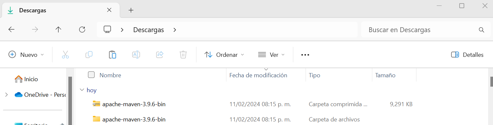

4. La carpeta que se extrae hay que moverla a la carpeta de archivos instalados para mantener la organización de los archivos de instalación.

**Paso 3: Configurar Variables de Entorno**

1. Abre el menú de inicio de Windows y busca "Editar variables de entorno del sistema".

   

2. En el campo "Nombre de la variable", ingresa `M2_HOME`.

   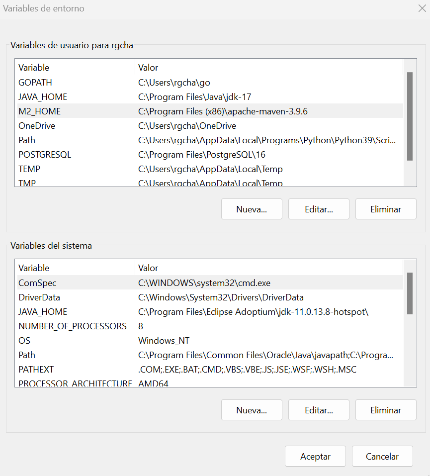

3. En el campo "Valor de la variable", ingresa la ruta completa de la carpeta de Apache Maven que extrajiste anteriormente (por ejemplo, `C:\ruta\a\apache-maven-3.9.6`).

4. Haz clic en "Aceptar" para guardar la nueva variable de entorno.

5. En la sección "Variables del sistema", busca la variable `Path` y haz clic en "Editar".

   

6. En la ventana de edición de la variable `Path`, haz clic en "Nuevo" y luego ingresa `%M2_HOME%\bin`.

7. Haz clic en "Aceptar" para guardar los cambios.

   

8. Haz clic en "Aceptar" para guardar los cambios y cerrar todas las ventanas.

**Paso 4: Verificar la Instalación:**

1. Abre una nueva ventana de símbolo del sistema o PowerShell.
2. Escribe el siguiente comando y presiona Enter: `mvn --version`.
3. Si Apache Maven se instaló correctamente, verás la información de la versión de Maven en la línea de comandos.

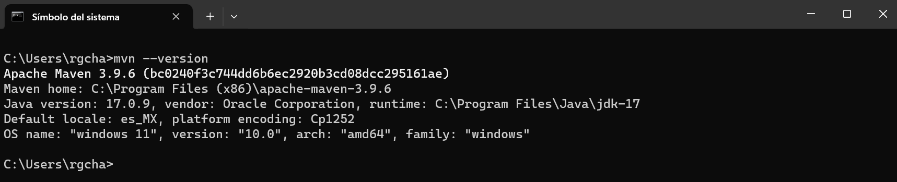

¡Felicidades! Has instalado Apache Maven en tu sistema Windows. Ahora podremos comenzar a utilizar Maven para gestionar los proyectos del curso de manera eficiente.

### **OPEN SSL**

OpenSSL es una herramienta de código abierto que se utiliza para implementar protocolos de seguridad SSL/TLS en aplicaciones web y de red. 

**Paso 1: Descargar e Instalar OPEN SSL**

1. Visita el sitio web oficial de Shining Light Production (https://slproweb.com/products/Win32OpenSSL.html) y descarga el instalador (exe) dependiendo la versión de tu procesador (32 o 64 bits) y seleccionando el completo, no el Light.

   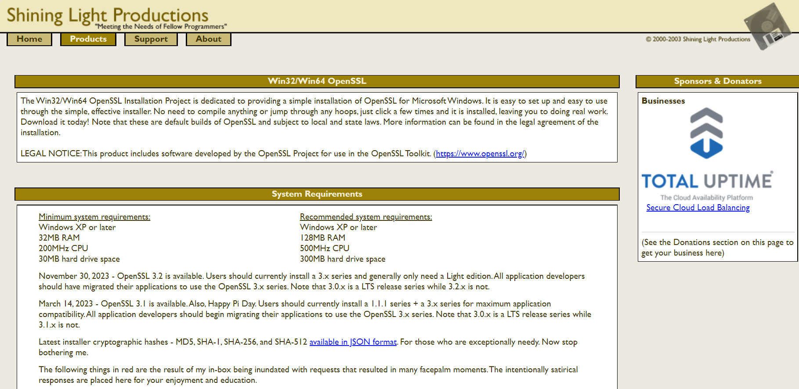

   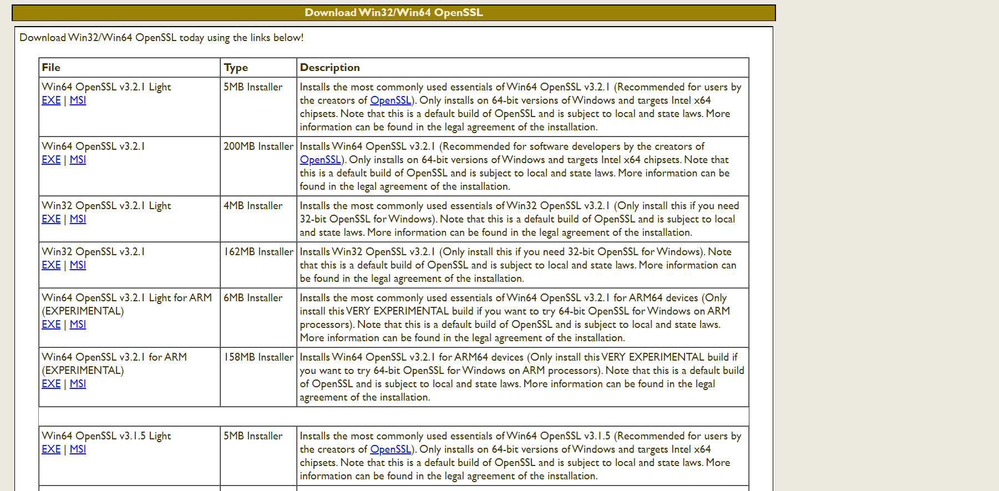

2. Ejecuta el instalador descargado. 

   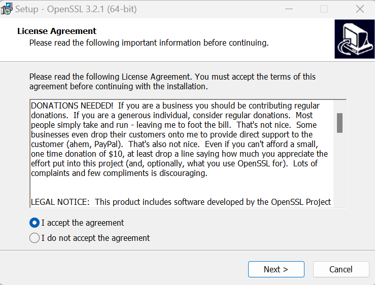

3. Selecciona la ruta de instalación de tu equipo.

   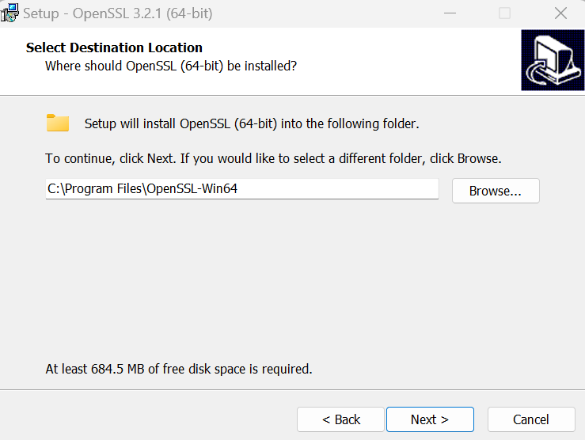

   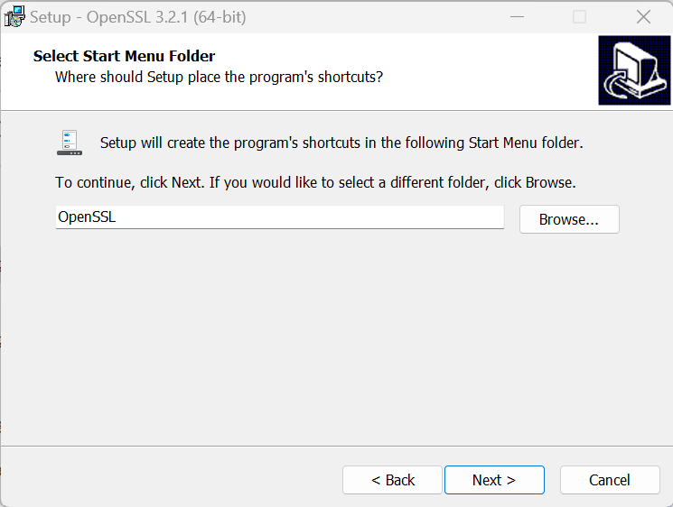

4. Selecciona el directorio de instalación en tu sistema.

   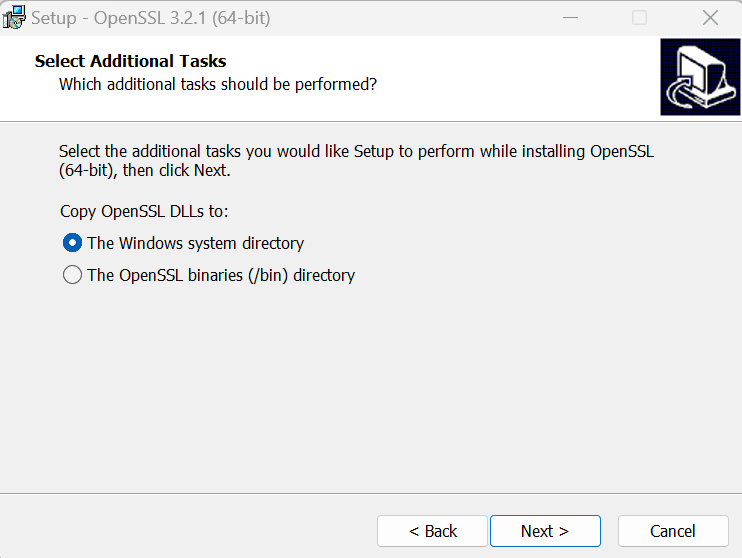

5. Se muestra un resumen de instalación, da clic en "Install". 

   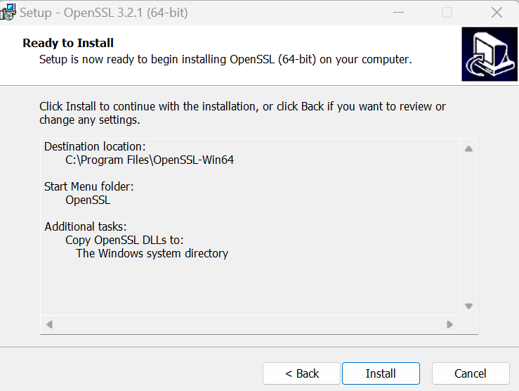

6. Comienza la instalación.

   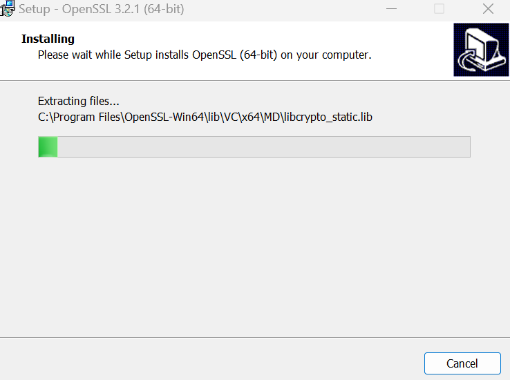

7. Finaliza la instalación.

   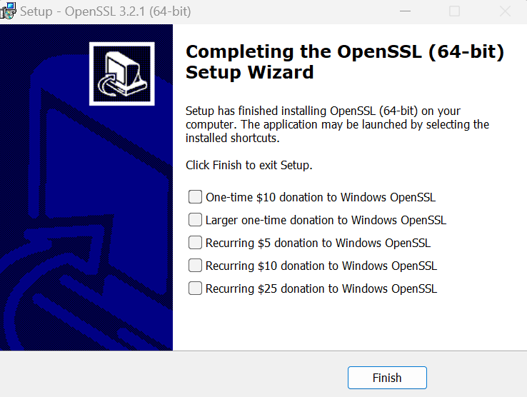

**Paso 2: Configurar Variables de Entorno**

1. Abre el menú de inicio de Windows y busca "Editar variables de entorno del sistema".

   

2. En la sección "Variables del sistema", selecciona la variable "Path" y haz clic en "Editar".

   

3. Haz clic en "Nuevo" y agrega la ruta de la carpeta donde se instaló OpenSSL (por ejemplo, "C:\Program Files\OpenSSL-Win64\bin").

   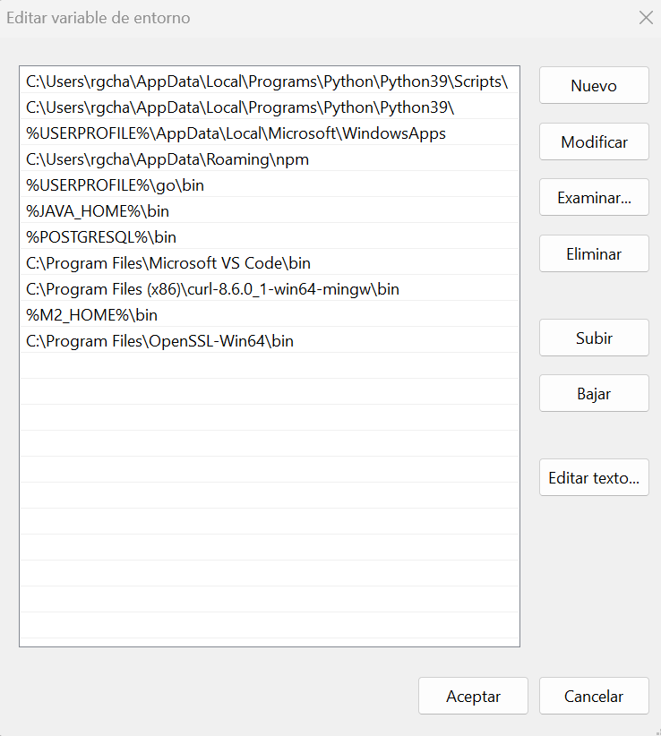

4. Haz clic en "Aceptar" para guardar los cambios y cerrar todas las ventanas.

**Paso 4: Verificar la Instalación**

1. Abre la línea de comandos de Windows.
2. Escribe el siguiente comando y presiona Enter: `openssl --version`.
3. Si OpenSSL se instaló correctamente, podrás visualizar la versión instalada en tu equipo de OpenSSL.

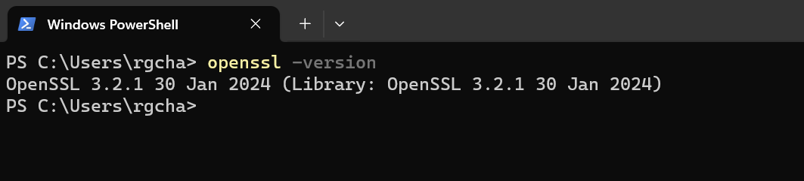

¡Felicidades! Has instalado OpenSSL correctamente en tu sistema Windows. Ahora puedes utilizar OpenSSL para implementar protocolos de seguridad SSL/TLS en tus aplicaciones web y de red.
